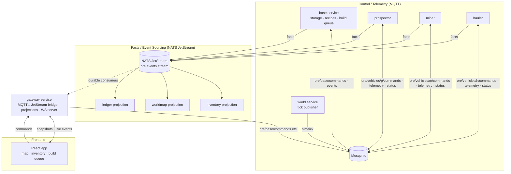

# Ore

A distributed mining and resource-utilisation simulation built to learn **event-driven architecture** hands-on.

Raw materials are prospected in the landscape, extracted, and hauled back to the base where they are stored and spent to build new vehicles and mining equipment. The base is seeded with a small stockpile and one of each vehicle — **materials are required to extract materials** — so the player must bootstrap capability before the stockpile runs out.

The simulation is an evolution of [hazard](https://github.com/ryancdotnet/hazard): the same tick-based entity model, but the entities are now *separate processes* that communicate only through message brokers instead of an in-process event bus.

## Learning goals

The point of this project is to get hands-on with event-driven architecture. Each milestone maps to specific concepts:

| Concept | Where it shows up |
|---|---|
| Command vs event | Commands on MQTT, facts on JetStream — the same action produces both |
| Command/query separation | Commands to MQTT, reads from projections |
| Topic & stream design | `ore/vehicles/<id>/...` topic tree; `ore.events` stream subjects |
| MQTT QoS semantics | QoS 0 ticks, QoS 1 commands, QoS 2 exactly-once for critical ops |
| Retained messages & LWT | Vehicle `status` retained; LWT flags dead entities |
| At-least-once + idempotency | Duplicate `materials.deposited` must not double-count |
| Event sourcing & projections | JetStream log is the source of truth; read models are rebuilt from it |
| Replay / rebuild | Wipe projections, replay the stream from sequence 0 |
| Ordering & latency in distributed systems | Tick-number metadata; eventual consistency accepted in v1 |
| Backpressure & ack policies | JetStream consumer ack strategies |
| Outbox pattern | Base emits facts reliably via an outbox (kafkaesque tie-in) |
| Schema evolution | Enveloped events with a `version` field; JSON in v1, protobuf later |

## Tech stack

- **Backend**: Go 1.26 — one binary per service (`cmd/`), shared packages in `internal/`
- **Message brokers**: [Eclipse Mosquitto](https://mosquitto.org/) (MQTT) + [NATS Server](https://nats.io/) with JetStream
- **Clients**: [eclipse-paho/paho.golang](https://github.com/eclipse-paho/paho.golang) for MQTT, [nats-io/nats.go](https://github.com/nats-io/nats.go) for NATS
- **Frontend**: React + TypeScript + Vite, WebSocket to the gateway
- **Infra**: docker-compose for brokers + services
- **Conventions**: structured logging via `slog`, golangci-lint, pre-commit (carried over from `hazard`)

## Architecture

Two brokers, two jobs:

- **MQTT = the control / telemetry plane.** The base and every vehicle communicate through it: commands, acknowledgements, telemetry, retained status, last-will messages. This is the "living" channel.
- **NATS JetStream = the fact / event-sourcing plane.** Every state change is published as an immutable fact. Streams are the source of truth; durable consumers rebuild read models (projections). This is the "history" channel.

Services never talk directly — only through the brokers.

## Services

| Service | Responsibility |
|---|---|
| `world` | Owns the global clock. Publishes `sim/tick` (tick number + timestamp) on MQTT every ~300ms. Owns terrain and seeds deposits. Does **not** own entities. |
| `base` | Material storage, build queue, refinery, vehicle dispatch. Reacts to tick + commands; issues command messages to vehicles over MQTT. Emits facts via an outbox. |
| `vehicle` | One binary, `--kind=prospector\|miner\|hauler`. A state machine that advances one step per tick. Publishes telemetry and facts. |
| `gateway` | Single bridge for the frontend. Subscribes entity facts from JetStream, runs the projections, serves the React app over WebSocket (snapshots + live event stream), and turns FE commands into MQTT command messages. |

## Tick model

- The `world` service owns the clock. It broadcasts `sim/tick` over MQTT (QoS 0, not retained).
- Entities do **not** run their own sim timers. On each tick they advance their state machine by exactly one step.
- Travel, scanning and extraction are modelled as **tick-countdowns** (e.g. travel to `(x,y)` takes `ceil(dist / speed)` ticks).
- Fuel is consumed per operating tick.
- Facts carry the `tick` number they occurred on, so downstream can reason about ordering.
- Determinism is **best-effort**: processes may process ticks slightly out of order. v1 accepts eventual consistency — this is an intentional, documented learning point about ordering in distributed systems.

## Projections (durable consumers on `ore.events`)

| Projection | Read model | Drives |
|---|---|---|
| `inventory` | base stockpile + per-vehicle cargo + build queue | FE inventory, crafting gate, economy balance |
| `worldmap` | deposits discovered, vehicle positions, base | FE map render |
| `ledger` | append-only record of every event | FE history, replay, debugging |

All projections are **rebuildable**: wipe the KV, replay the stream from sequence 0. `nats` CLI one-liners in the docs.

## Domain model

### Materials (v1)

- **Iron Ore** — mined; building material
- **Copper Ore** — mined; building material
- **Fuel** — refined at base from ore; consumed by every vehicle per operating tick

Materials are simultaneously *currency* (build vehicles) and *consumable* (burn fuel), so every unit spent is a choice.

### Vehicles

| Vehicle | Behaviour | Cost (defaults) |
|---|---|---|
| **Prospector** | Travels to a scan site, scans a radius, discovers/estimates deposits. Speed fast, scan expensive. | 25 iron + 15 copper |
| **Miner** | Travels to a known deposit, extracts ore into cargo until full, returns to base. | 40 iron + 20 copper |
| **Hauler** | Ferries ore between miners/deposits and base, unloads into storage. | 20 iron + 30 copper |

Fuel burn (defaults, tune later): prospector 1 / 2 ticks, miner 1 / tick, hauler 1 / tick. Vehicles keep a reserve to return to base; when fuel runs low they auto-return to refuel (base refills from stockpile at zero cost) — this is the soft pressure that forces spending.

### Catch-22 economy (seed + defaults)

Base starts with: **1 prospector, 1 miner, 1 hauler** and stockpile **100 iron, 50 copper, 100 fuel**.

Refinery recipe: `1 iron + 1 copper → 2 fuel`.

The loop: prospectors find deposits → miners extract → haulers bank the materials → spend on new vehicles and fuel → more capacity → faster extraction. The tension is early: the stockpile is finite and everything burns fuel, so a player who dispatches unwisely stalls. Numbers are tunable in a single config file (`internal/sim/config.go`).

## Entity state machines

Each vehicle is a state machine advancing per tick:

- **Prospector**: `idle → travel → scan → travel → idle` (emits `deposit.discovered` at scan completion)
- **Miner**: `idle → travel → extract → travel → idle` (emits `materials.extracted` at unload into cargo; `materials.deposited` when the hauler/base receives it)
- **Hauler**: `idle → travel → load → travel → unload` (emits `materials.deposited` at base)
- **Base**: reacts to ticks and commands; owns the build queue and refinery; emits `vehicle.built`, `fuel.refined`, `vehicle.dispatched`; persists state to an outbox for reliable fact emission

Stall rule: an operation that would take fuel below reserve halts the vehicle (`vehicle.stalled`), and it returns to base to refuel.

## Frontend (React)

WebSocket connection to the gateway. Message kinds:

- **BE → FE**: projection snapshots (inventory, worldmap) on connect + on change; live event stream (each fact with its `tick`, enabling a tick scrubber for replay)
- **FE → BE**: commands — `build_vehicle`, `refine_fuel`, `dispatch` (select entity + destination)

Views (v1): canvas world map (entities, discovered deposits, base), inventory panel (stockpile + per-vehicle cargo), build/craft queue, event ledger.

## Open questions / future work

- Protobuf (or Avro + registry, as in kafkaesque) event encoding and schema evolution tooling.
- Distributed tick ordering: sequence-number reconciliation, or per-entity clocks — a deliberate later exercise.
- Refuel delivery (fuel tanker entity) instead of auto-return.
- Continuous terrain vs grid; pathfinding upgrades.
- Persist projections to NATS KV vs in-memory.
